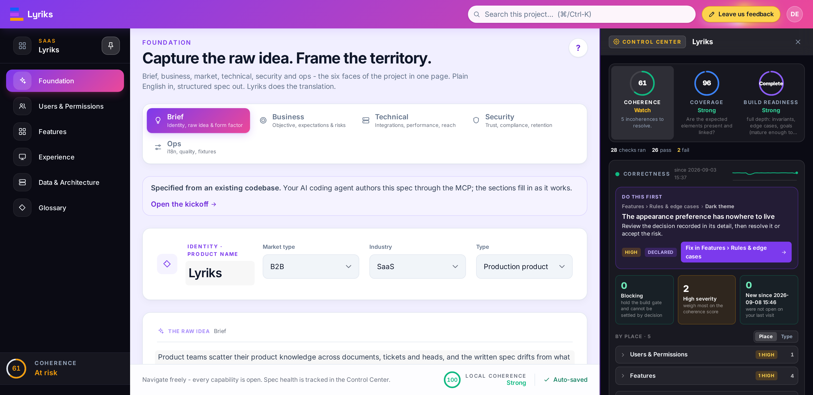

<div align="center">


# Lyriks Community Edition

**Turn code into specs. Find gaps. Understand what a change affects.**

[](https://github.com/lyriks-io/lyriks-community/actions/workflows/ci.yml)
[](https://github.com/lyriks-io/lyriks-community/actions/workflows/publish-image.yml)



<sub>The Control Center, open from any page: the scores, the checks behind them, and the next thing to fix.</sub>

</div>

Lyriks is a self-hosted workspace that connects a product's features, rules,
screens and data in one specification. Your AI coding client reads the code
and writes the spec through MCP (Model Context Protocol). You review it in
the browser and use Lyriks to check for gaps and contradictions.

## What you can do with it

Each of these works from the spec and evidence recorded so far. None of them
replaces tests of the running application.

### Code to spec

You need to know what a product does, and only its code can tell you.
Lyriks turns what your AI client reads in that code into a spec, with links
back to the source.

### Coherence

You need to know whether features, permissions and rules contradict each
other or leave gaps.
Lyriks checks the recorded spec and reports the issues to review and fix.

### Impact analysis

You need to know what to review before changing a feature or rule.
Lyriks exposes the links between features, screens, rules and data, so you
and your AI client can see what the change may affect.

### Implementation analysis

You need to know how much of the spec is reflected in the code.
Lyriks uses the code evidence supplied by your AI client to report mapped
elements, missing implementation and changes since the last sync.

## What leaves your machine

Lyriks stores your projects locally and makes no automatic calls to public
services by default. Activation uses an email address supplied on
<https://get.lyriks.io>. A connected AI client may send the code and spec it
reads to its provider; its data policy applies. Optional external integrations
require separate configuration.

## Quick start

### 1. Install

The installer sets up the database, app and MCP gateway on your machine.
Internet access is needed to download them and obtain a Community key.

Linux and macOS:

```bash
curl -fsSL https://get.lyriks.io | sh
```

Windows, in PowerShell:

```powershell
irm https://get.lyriks.io/windows | iex
```

Open the address printed by the installer. The first user activates the
install with the Community key sent to their email address and chooses the
operator password. The key is verified locally. Lyriks then runs without a
connection to the licensing service.

The published images target `linux/amd64`. Native arm64 images and Apple
Silicon installation have not been validated by the release workflow.

### 2. Connect your AI client

Point the client at your install's address followed by `/mcp`. With Claude Code:

```bash
claude mcp add --scope user --transport http lyriks http://localhost:3000/mcp
```

Then run `/mcp` in Claude Code and sign in with the operator password. Cursor
and other clients take the same URL in their MCP settings:

```json
{ "mcpServers": { "lyriks": { "url": "http://localhost:3000/mcp" } } }
```

The [MCP guide](docs/mcp.md) covers authentication and the gateway itself.

### 3. Create your first spec

Open the client in the repository you want to describe and ask it:

> Using the Lyriks MCP and the lyriks-retrospec guide, create a project named
> "First spec" from this codebase. Use the source code as evidence and link
> the modelled behaviour back to it. Do not change the application's code.

The client reads your checkout and writes the spec through MCP. Open the
project in Lyriks to review it. [Getting started](docs/getting-started.md)
walks through this first pass and how to check the result against the product.

## Community and Enterprise

Community provides the specification workspace with one operator account.
Enterprise adds team access and formal verification.

| | Community | Enterprise |
|---|---|---|
| Accounts and access | one operator account, password-protected | workspaces, members, invitations, roles, per-project grants |
| The workspace | all of it: foundation, users, features and behaviour, journeys and screens, rules, data, architecture, coherence, roadmap | the same, shared across a team |
| Checking the spec | coherence checks, behaviour checks and scores | plus formal verification of the whole spec |
| Hosting | self-hosted | self-hosted |
| Licence | AGPL-3.0-only, open source | commercial |

See [Editions](docs/editions.md) for the full comparison.

## Other ways to run it

With Docker and Docker Compose available, you can run the stack directly:

```bash
git clone https://github.com/lyriks-io/lyriks-community.git
cd lyriks-community
cp .env.example .env
# Generate two values, then uncomment and set the matching entries in .env:
openssl rand -hex 16    # POSTGRES_PASSWORD
openssl rand -hex 32    # LYRIKS_JWT_SECRET
docker compose up -d
```

Open <http://localhost:3000> and activate it as described above.

The Compose file pins the images to the version you cloned. Updating means
backing up the volumes and moving to a newer checkout, as described in
[Updates and backups](docs/getting-started.md#updates-and-backups). The
installer automates that, with rollback and diagnostics.

## Work on the code

Requirements: Node 22, pnpm 10.6.3 (`corepack enable`), PostgreSQL 16.

```bash
git clone https://github.com/lyriks-io/lyriks-community.git
cd lyriks-community
corepack enable
pnpm install
cp .env.example .env        # set LYRIKS_PG_URL to your PostgreSQL
pnpm dev:community          # the app; the URL is printed (8173 under WSL)
```

In a second terminal, run `pnpm dev:mcp`. If the app uses a port other than
5173, set `LYRIKS_BASE_URL` to its address in that terminal first. Under WSL,
use `export LYRIKS_BASE_URL=http://localhost:8173`.

Development needs no licence key or login with the default configuration.
Run `pnpm check && pnpm test` before submitting a change;
[.github/workflows/ci.yml](.github/workflows/ci.yml) is the full sequence CI
runs on pull requests and pushes to `main`.

## Documentation

The [docs](docs/README.md) cover getting started, every configuration variable,
the architecture, the MCP gateway and its skills, what each score means, when a
project is finished, and the release process.
[CHANGELOG.md](CHANGELOG.md) lists what each version changed.

## Contributing and support

Bug reports, documentation fixes and code contributions are welcome. Read
[CONTRIBUTING.md](CONTRIBUTING.md) and the engineering rules in
[AGENTS.md](AGENTS.md) before starting.

Each commit needs a DCO sign-off (`git commit -s`). Contributors also accept
the [CLA](CLA.md) with their first pull request. It lets the maintainers
distribute contributions under other terms, including the proprietary
Enterprise licence. Everyone taking part follows the
[Code of Conduct](CODE_OF_CONDUCT.md).

[SUPPORT.md](SUPPORT.md) says where a question, a bug or an install problem
goes. Security issues go through [SECURITY.md](SECURITY.md), never through a
public issue.

## Licence

Copyright (C) 2026 Lyriks. Licensed under the GNU Affero General Public
License v3.0 only (`AGPL-3.0-only`), see [LICENSE](LICENSE). "Lyriks" is a
trademark; the licence covers the code, not the name.
